# Componentes e suas interações

O objetivo deste repositório e mostrar de forma simples o funcionamento de componentes gerais para disciplina de aplicação web

## O que é um componente

---
🔧 Definição simples de componente

Um componente é uma função (ou classe) que retorna uma parte da interface visual da aplicação — como um botão, uma lista, uma tela inteira, etc.

## Inicio! 

Vamos criar um diretório com componentes HTML + PHP simples, focando só no funcionamento básico — sem CSS no primeiro momento. A ideia é mostrar entendermos como HTML interage com o PHP e como os componentes do Bootstrap funcionam.

📁 Estrutura dos arquivos:

```css
componentes/
│
├── index.php           # Página principal com links
├── botao.php           # Exemplo de botão
├── tabela.php          # Exemplo de tabela
├── modal.php           # Exemplo de modal
├── toast.php           # Exemplo de toast
├── lista.php           # Exemplo de lista
|── checkbox.php        # Exemplo de Checkbox 
├── select.php          # Exemplo de select
├── validacao.php       # validacao.php
└── dados.php           # Arquivo com variáveis PHP (reutilizado)

```
---

📄 1. dados.php

Este arquivo vai simular dados em PHP que serão usados pelos componentes:

```php
<?php
$nome = "Maria";
$itens = ["Arroz", "Feijão", "Macarrão"];
$mensagem = "Bem-vindo ao site!";
$usuarios = [
  ["nome" => "João", "email" => "joao@email.com"],
  ["nome" => "Ana", "email" => "ana@email.com"],
];
?>
```
Lembrem que estes dados de alguma maneira podem vir diretamente do banco, isto fica como dica para sinalizarmos na nossa aplicação.

---

📄 2. index.php
Uma página inicial com links para cada exemplo:

```html
<!DOCTYPE html>
<html>
<head>
  <title>Componentes HTML/PHP</title>
</head>
<body>
  <h1>Exemplos de Componentes</h1>
  <ul>
    <li><a href="botao.php">Botão</a></li>
    <li><a href="tabela.php">Tabela</a></li>
    <li><a href="modal.php">Modal</a></li>
    <li><a href="toast.php">Toast</a></li>
    <li><a href="lista.php">Lista</a></li>
    <li><a href="formulario.php">Formulário</a></li>
    <li><a href="checkbox.php">Checkbox</a></li>
    <li><a href="select.php">Select</a></li>
    <li><a href="validacao.php">Validação</a></li>
  </ul>
</body>
</html>

```

---

📄 3. botao.php
Um botão que exibe o nome vindo do PHP:

```html
<?php include 'dados.php'; ?>
<!DOCTYPE html>
<html>
<head><title>Botão</title></head>
<body>
  <h2>Exemplo de Botão</h2>
  <button onclick="alert('Olá, <?php echo $nome; ?>!')">Clique aqui</button>
</body>
</html>


```

📄 4. tabela.php
Exibe os usuários em uma tabela simples:

```html
<?php include 'dados.php'; ?>
<!DOCTYPE html>
<html>
<head><title>Tabela</title></head>
<body>
  <h2>Lista de Usuários</h2>
  <table border="1">
    <tr><th>Nome</th><th>Email</th></tr>
    <?php foreach ($usuarios as $user): ?>
      <tr>
        <td><?php echo $user['nome']; ?></td>
        <td><?php echo $user['email']; ?></td>
      </tr>
    <?php endforeach; ?>
  </table>
</body>
</html>


```
---

📄 5. lista.php

Mostra uma lista de itens em PHP:

```html
<?php include 'dados.php'; ?>
<!DOCTYPE html>
<html>
<head><title>Lista</title></head>
<body>
  <h2>Lista de Compras</h2>
  <ul>
    <?php foreach ($itens as $item): ?>
      <li><?php echo $item; ?></li>
    <?php endforeach; ?>
  </ul>
</body>
</html>

```

📄 6. modal.php

Simula um "modal" usando só HTML, sem JS ainda (vamos melhorar com Bootstrap depois):

```html
<?php include 'dados.php'; ?>
<!DOCTYPE html>
<html>
<head><title>Modal</title></head>
<body>
  <h2>Modal Simples</h2>
  <button onclick="document.getElementById('modal').style.display='block'">Abrir Modal</button>

  <div id="modal" style="display:none; border:1px solid #000; padding:10px;">
    <p><?php echo $mensagem; ?></p>
    <button onclick="document.getElementById('modal').style.display='none'">Fechar</button>
  </div>
</body>
</html>

```

📄 7. toast.php
Simulação de toast simples (alerta que aparece):


```html
<?php include 'dados.php'; ?>
<!DOCTYPE html>
<html>
<head><title>Toast</title></head>
<body>
  <h2>Toast (Aviso)</h2>
  <button onclick="mostrarToast()">Mostrar Mensagem</button>

  <div id="toast" style="display:none; border:1px solid #444; padding:10px; margin-top:10px;">
    <?php echo $mensagem; ?>
  </div>

  <script>
    function mostrarToast() {
      const toast = document.getElementById('toast');
      toast.style.display = 'block';
      setTimeout(() => { toast.style.display = 'none'; }, 3000);
    }
  </script>
</body>
</html>
```

📝 8. Formulário com POST
Permite o envio de dados e leitura com $_POST.

📄 formulario.php:

```html
<?php
$nome = "";
if ($_SERVER["REQUEST_METHOD"] == "POST") {
  $nome = $_POST["nome"];
}
?>
<!DOCTYPE html>
<html>
<head><title>Formulário</title></head>
<body>
  <h2>Formulário Simples</h2>
  <form method="post">
    <label>Seu nome:</label>
    <input type="text" name="nome" />
    <button type="submit">Enviar</button>
  </form>

  <?php if ($nome): ?>
    <p>Olá, <?php echo htmlspecialchars($nome); ?>!</p>
  <?php endif; ?>
</body>
</html>

```


✅ 9. Checkbox / Radio Buttons

Permite a capturar múltiplas opções e decisões do usuário.
📄 checkbox.php:

```html
<?php
$escolhas = $_POST['comidas'] ?? [];
?>
<!DOCTYPE html>
<html>
<head><title>Checkbox</title></head>
<body>
  <h2>Escolha as comidas</h2>
  <form method="post">
    <label><input type="checkbox" name="comidas[]" value="Pizza"> Pizza</label><br>
    <label><input type="checkbox" name="comidas[]" value="Hambúrguer"> Hambúrguer</label><br>
    <label><input type="checkbox" name="comidas[]" value="Sushi"> Sushi</label><br>
    <button type="submit">Enviar</button>
  </form>

  <?php if ($escolhas): ?>
    <h3>Você escolheu:</h3>
    <ul>
      <?php foreach ($escolhas as $item): ?>
        <li><?php echo $item; ?></li>
      <?php endforeach; ?>
    </ul>
  <?php endif; ?>
</body>
</html>

```


📦 10. Select (Dropdown)
Bom para mostrar como capturar uma escolha entre opções.

📄 select.php:

```html
<?php
$escolha = $_POST['fruta'] ?? '';
?>
<!DOCTYPE html>
<html>
<head><title>Select</title></head>
<body>
  <h2>Escolha uma fruta</h2>
  <form method="post">
    <select name="fruta">
      <option value="maçã">Maçã</option>
      <option value="banana">Banana</option>
      <option value="laranja">Laranja</option>
    </select>
    <button type="submit">Confirmar</button>
  </form>

  <?php if ($escolha): ?>
    <p>Você escolheu: <?php echo $escolha; ?></p>
  <?php endif; ?>
</body>
</html>

```

🛠️ 11. Input com validação simples
Para mostrar required, maxlength, e mensagens.

📄 validacao.php:

```html
<?php
$mensagem = "";
if ($_SERVER["REQUEST_METHOD"] == "POST") {
  $email = $_POST['email'] ?? '';
  if (!filter_var($email, FILTER_VALIDATE_EMAIL)) {
    $mensagem = "E-mail inválido!";
  } else {
    $mensagem = "E-mail enviado: " . $email;
  }
}
?>
<!DOCTYPE html>
<html>
<head><title>Validação</title></head>
<body>
  <h2>Validação de E-mail</h2>
  <form method="post">
    <input type="email" name="email" required placeholder="Digite seu e-mail" />
    <button type="submit">Enviar</button>
  </form>
  <p><?php echo $mensagem; ?></p>
</body>
</html>

```
Abaixo vemos tudo criado até o momento:

---
index.php:

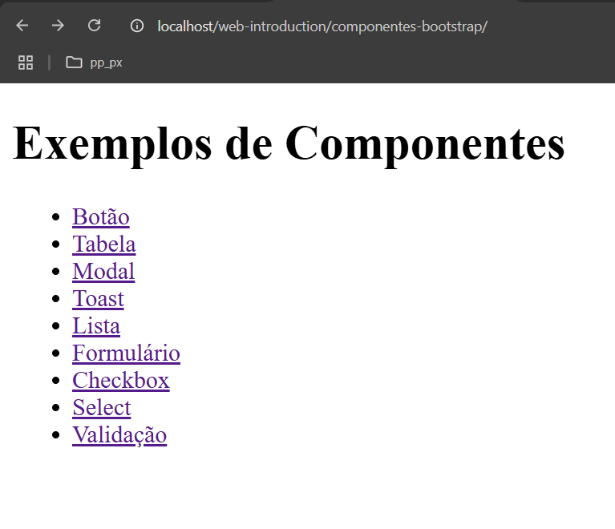
---

---
botao.php:

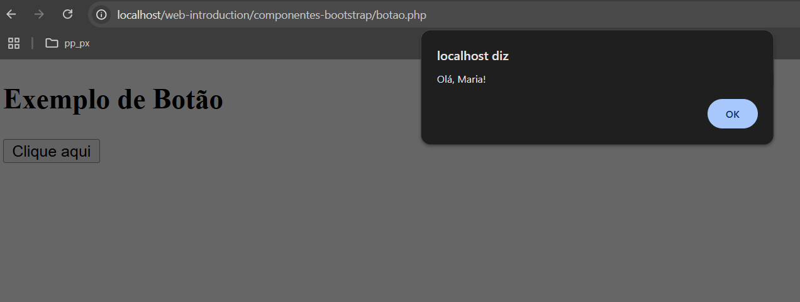
---

---
checkbox.php:

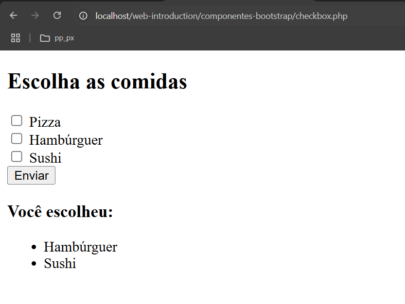
---

---
formulario.php:

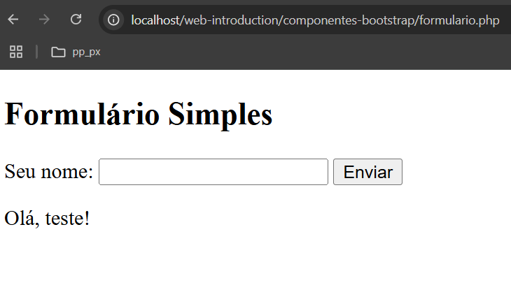
---

---
lista.php:

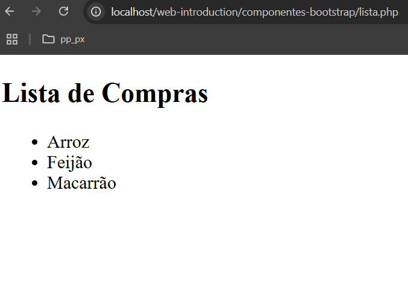
---

---
modal.php:

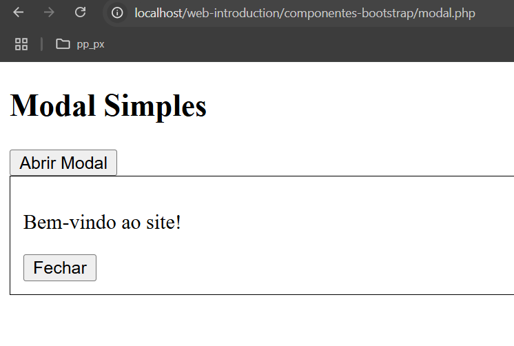
---

---
select.php:

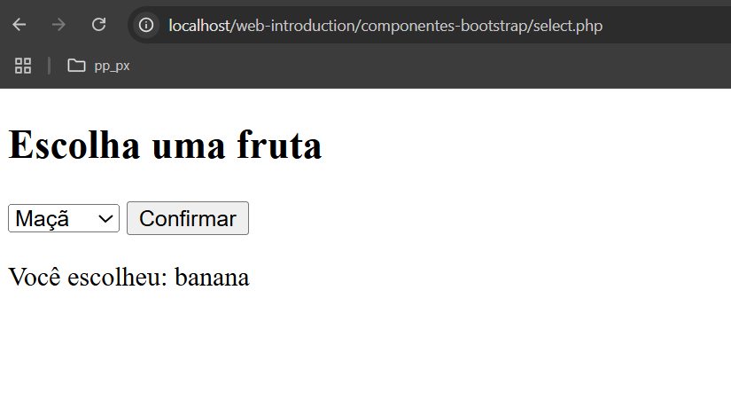
---

---
tabela.php:

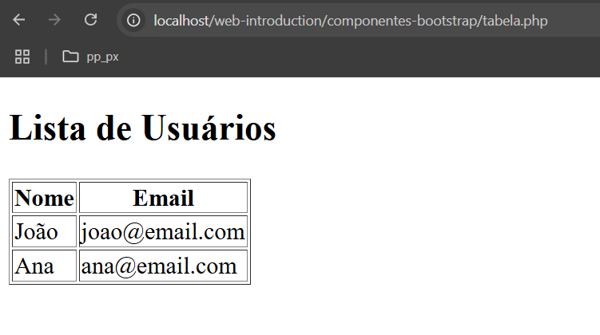
---

---
toast.php:

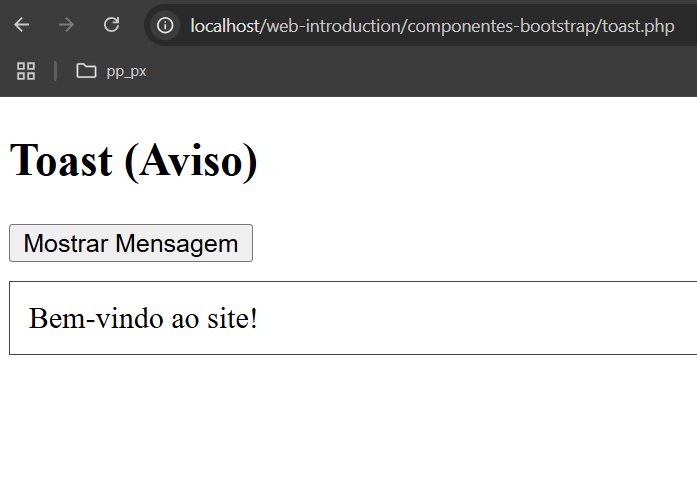
---

---
validacao.php:

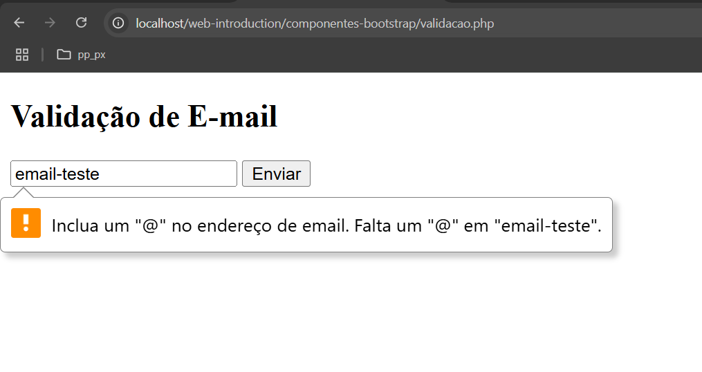
---

✅ Até o momento:

Com esses arquivos, aprendemos:
- Como usar variáveis do PHP dentro do HTML
- Como montar componentes básicos como botão, tabela, lista
- Como fazer uma lógica simples com PHP + HTML
- Como simular funcionalidades como modal e toast

## Estilizando os nosso componentes

✅ ETAPA 1: Adicionar Bootstrap no Projeto
Em todos os arquivos .php, vamos adicionar o link do Bootstrap 5 dentro do head (em vez de baixar, usamos CDN).
Vamos criar um arquivo de cabeçalho e rodapé, para otimizarmos o nosso código:


🧩 header.php 

- Dentro simplismente adicionamos o apontamento para o css online
```php
<!-- header.php -->
<!DOCTYPE html>
<html lang="pt-br">
<head>
  <meta charset="UTF-8">
  <title>Meu Site</title>
  <link href="https://cdn.jsdelivr.net/npm/bootstrap@5.3.3/dist/css/bootstrap.min.css" rel="stylesheet">
</head>
<body class="container mt-5">

```

E no final de cada página, podemos colocar um footer.php:

- Dentro adicionamos o javascript para animações do bootstrap
```php
<!-- footer.php -->
<script src="https://cdn.jsdelivr.net/npm/bootstrap@5.3.3/dist/js/bootstrap.bundle.min.js"></script>
</body>
</html> 
```

Para cada pagina vamos incluir com php o nosso footer e nosso header, da seguinte maneira: 

```php
<?php include 'dados.php'; ?>
<?php include 'header.php'; ?>
//conteudo aqui
<?php include 'footer.php'; ?>
```

🎨 botao.php

```html
<?php include 'dados.php'; ?>
<?php include 'header.php'; ?>
<h2 class="mb-4">Exemplo de Botão com Bootstrap</h2>
  <button class="btn btn-primary" onclick="alert('Olá, <?php echo $nome; ?>!')">Clique aqui</button>
<?php include 'footer.php'; ?>
```


🧾 tabela.php

```html
<?php include 'dados.php'; ?>
<?php include 'header.php'; ?>
<h2>Usuários</h2>
  <table class="table table-striped">
    <thead>
      <tr><th>Nome</th><th>Email</th></tr>
    </thead>
    <tbody>
      <?php foreach ($usuarios as $user): ?>
        <tr>
          <td><?php echo $user['nome']; ?></td>
          <td><?php echo $user['email']; ?></td>
        </tr>
      <?php endforeach; ?>
    </tbody>
  </table>
  <?php include 'footer.php'; ?>
```

💬 modal.php com Bootstrap

```html
<?php include 'dados.php'; ?>
<?php include 'header.php'; ?>

<h2>Modal com Bootstrap</h2>

  <!-- Botão para abrir o modal -->
  <button class="btn btn-warning" data-bs-toggle="modal" data-bs-target="#meuModal">Abrir Modal</button>

  <!-- Modal Bootstrap -->
  <div class="modal fade" id="meuModal" tabindex="-1" aria-hidden="true">
    <div class="modal-dialog">
      <div class="modal-content">
        <div class="modal-header">
          <h5 class="modal-title">Mensagem</h5>
          <button type="button" class="btn-close" data-bs-dismiss="modal"></button>
        </div>
        <div class="modal-body">
          <?php echo $mensagem; ?>
        </div>
        <div class="modal-footer">
          <button class="btn btn-secondary" data-bs-dismiss="modal">Fechar</button>
        </div>
      </div>
    </div>
  </div>
  <?php include 'footer.php'; ?>
```

🔔 toast.php com Bootstrap

```html

<?php include 'dados.php'; ?>
<?php include 'header.php'; ?>
<h2>Toast com Bootstrap</h2>

<button class="btn btn-success" onclick="mostrarToast()">Mostrar Toast</button>

<!-- Toast Bootstrap -->
<div id="meuToast" class="toast position-fixed top-0 end-0 m-3" role="alert">
  <div class="toast-header">
    <strong class="me-auto">Aviso</strong>
    <button type="button" class="btn-close" data-bs-dismiss="toast"></button>
  </div>
  <div class="toast-body">
    <?php echo $mensagem; ?>
  </div>
</div>

<script src="https://cdn.jsdelivr.net/npm/bootstrap@5.3.3/dist/js/bootstrap.bundle.min.js"></script>
<script>
  function mostrarToast() {
    const toast = new bootstrap.Toast(document.getElementById('meuToast'));
    toast.show();
  }
</script>
<?php include 'footer.php'; ?>
```

📌 lista.php

```html
<?php include 'dados.php'; ?>
<?php include 'header.php'; ?>

<h2>Lista de Compras</h2>
  <ul class="list-group">
    <?php foreach ($itens as $item): ?>
      <li class="list-group-item"><?php echo $item; ?></li>
    <?php endforeach; ?>
  </ul>
  <?php include 'footer.php'; ?>
```

📝 formulario.php com Bootstrap

```html
<?php
$nome = "";
if ($_SERVER["REQUEST_METHOD"] == "POST") {
  $nome = $_POST["nome"];
}
?>

<?php include 'header.php'; ?>

<h2>Formulário Simples</h2>
  <form method="post" class="mb-3">
    <div class="mb-3">
      <label class="form-label">Seu nome:</label>
      <input type="text" name="nome" class="form-control" />
    </div>
    <button type="submit" class="btn btn-primary">Enviar</button>
  </form>

  <?php if ($nome): ?>
    <div class="alert alert-success">Olá, <?php echo htmlspecialchars($nome); ?>!</div>
  <?php endif; ?>

<?php include 'footer.php'; ?>

```


✅ checkbox.php com Bootstrap

```html

<?php
$escolhas = $_POST['comidas'] ?? [];
?>

<?php include 'dados.php'; ?>
<?php include 'header.php'; ?>

<h2>Escolha as comidas</h2>
  <form method="post" class="mb-3">
    <div class="form-check">
      <input class="form-check-input" type="checkbox" name="comidas[]" value="Pizza" id="pizza">
      <label class="form-check-label" for="pizza">Pizza</label>
    </div>
    <div class="form-check">
      <input class="form-check-input" type="checkbox" name="comidas[]" value="Hambúrguer" id="hamburguer">
      <label class="form-check-label" for="hamburguer">Hambúrguer</label>
    </div>
    <div class="form-check">
      <input class="form-check-input" type="checkbox" name="comidas[]" value="Sushi" id="sushi">
      <label class="form-check-label" for="sushi">Sushi</label>
    </div>
    <button type="submit" class="btn btn-primary mt-2">Enviar</button>
  </form>

  <?php if ($escolhas): ?>
    <div class="alert alert-info">
      <strong>Você escolheu:</strong>
      <ul class="mb-0">
        <?php foreach ($escolhas as $item): ?>
          <li><?php echo $item; ?></li>
        <?php endforeach; ?>
      </ul>
    </div>
  <?php endif; ?>

  <?php include 'footer.php'; ?>

```


🍇 select.php com Bootstrap

```html

<?php
$escolha = $_POST['fruta'] ?? '';
?>
<?php include 'dados.php'; ?>
<?php include 'header.php'; ?>

<h2>Escolha uma fruta</h2>
  <form method="post" class="mb-3">
    <div class="mb-3">
      <select name="fruta" class="form-select">
        <option value="">Selecione...</option>
        <option value="maçã">Maçã</option>
        <option value="banana">Banana</option>
        <option value="laranja">Laranja</option>
      </select>
    </div>
    <button type="submit" class="btn btn-success">Confirmar</button>
  </form>

  <?php if ($escolha): ?>
    <div class="alert alert-secondary">Você escolheu: <strong><?php echo $escolha; ?></strong></div>
  <?php endif; ?>

  <?php include 'footer.php'; ?>

```


📧 validacao.php com Bootstrap


```html
<?php
$mensagem = "";
$classe = "";
if ($_SERVER["REQUEST_METHOD"] == "POST") {
  $email = $_POST['email'] ?? '';
  if (!filter_var($email, FILTER_VALIDATE_EMAIL)) {
    $mensagem = "E-mail inválido!";
    $classe = "danger";
  } else {
    $mensagem = "E-mail enviado: " . htmlspecialchars($email);
    $classe = "success";
  }
}
?>

<?php include 'header.php'; ?>

<h2>Validação de E-mail</h2>
  <form method="post" class="mb-3">
    <div class="mb-3">
      <input type="email" name="email" class="form-control" placeholder="Digite seu e-mail" required />
    </div>
    <button type="submit" class="btn btn-outline-primary">Enviar</button>
  </form>

  <?php if ($mensagem): ?>
    <div class="alert alert-<?php echo $classe; ?>"><?php echo $mensagem; ?></div>
  <?php endif; ?>

  <?php include 'footer.php'; ?>

```

Abaixo vemos tudo criado com bootstrap:

---
index.php:


---

---
botao.php:

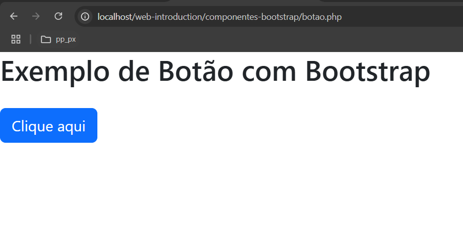
---

---
checkbox.php:

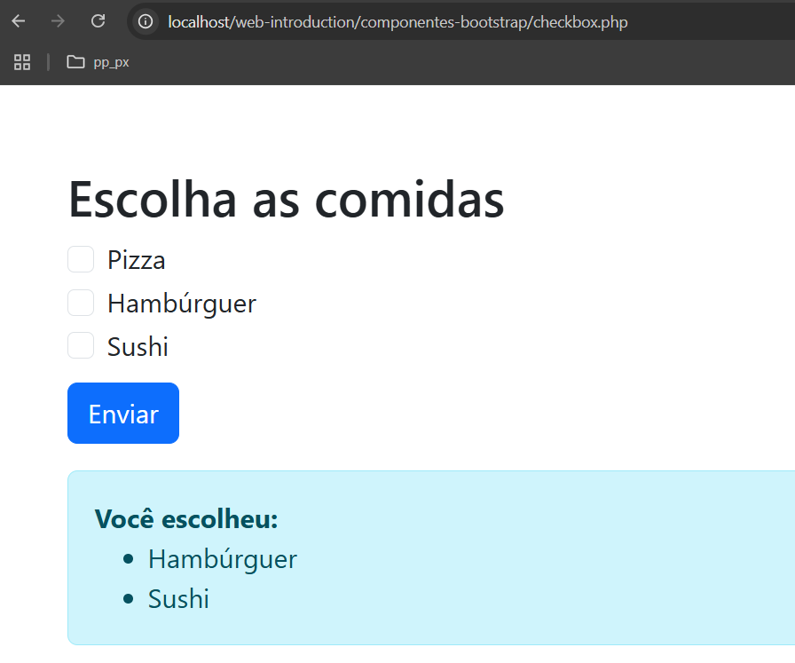
---

---
formulario.php:

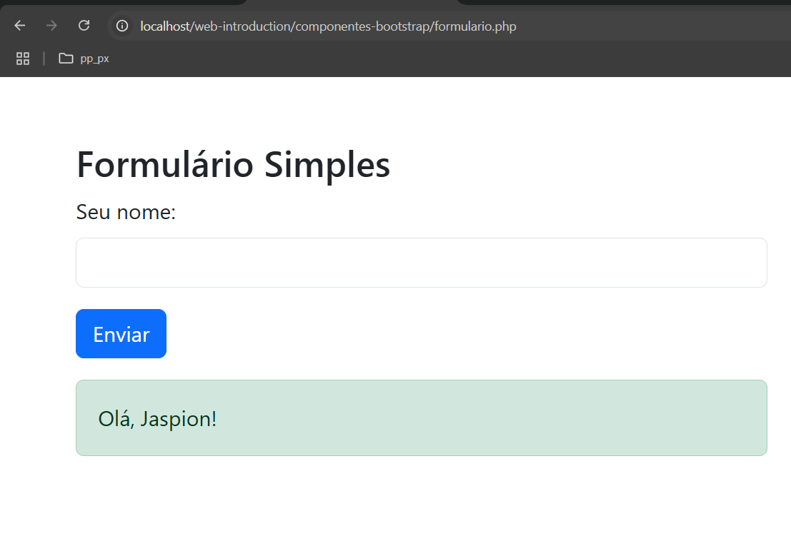
---

---
lista.php:

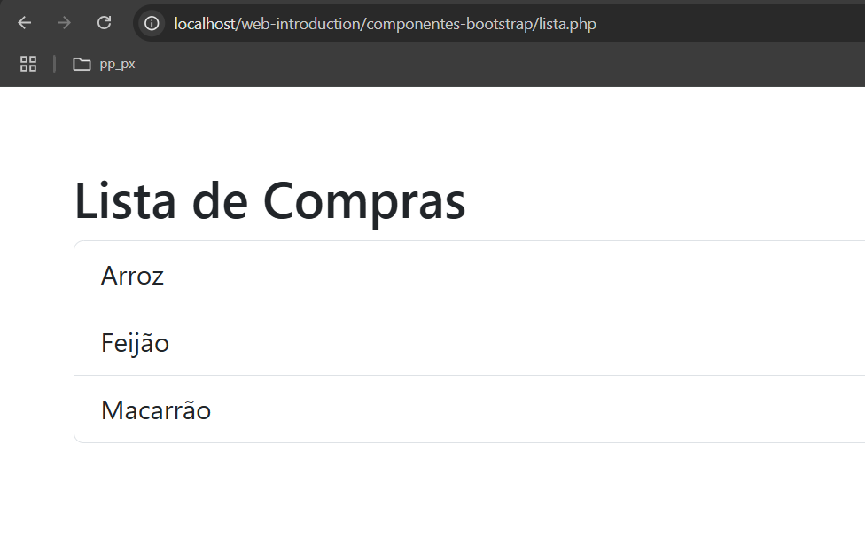
---

---
modal.php:

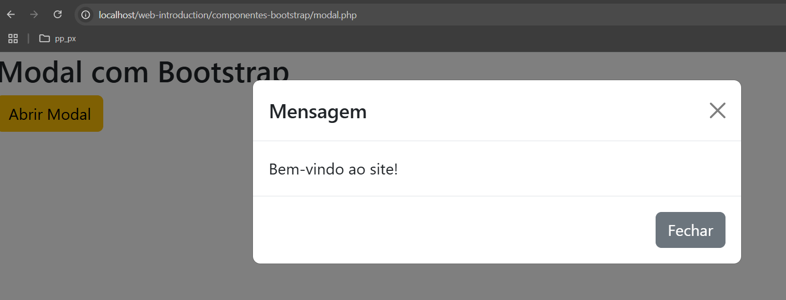
---

---
select.php:

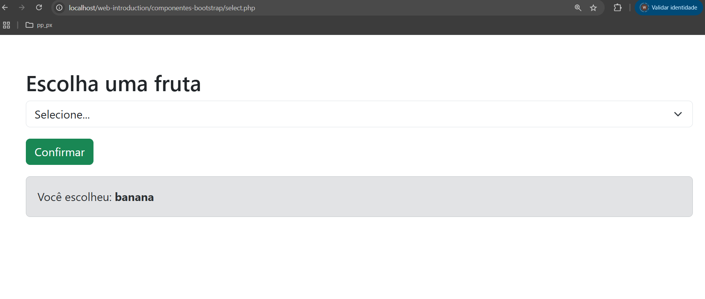
---

---
tabela.php:

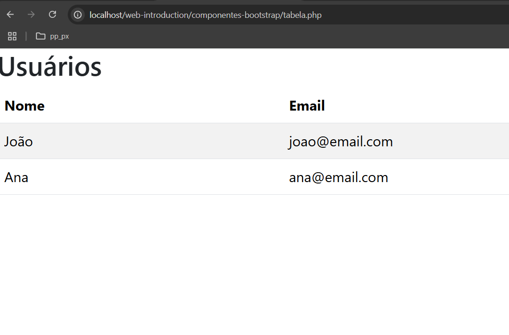
---

---
toast.php:

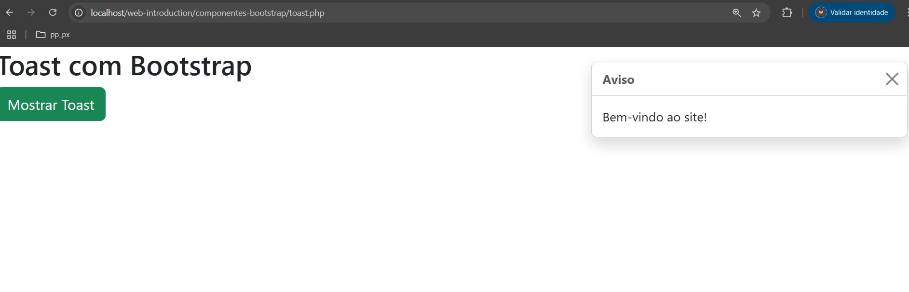
---

---
validacao.php:

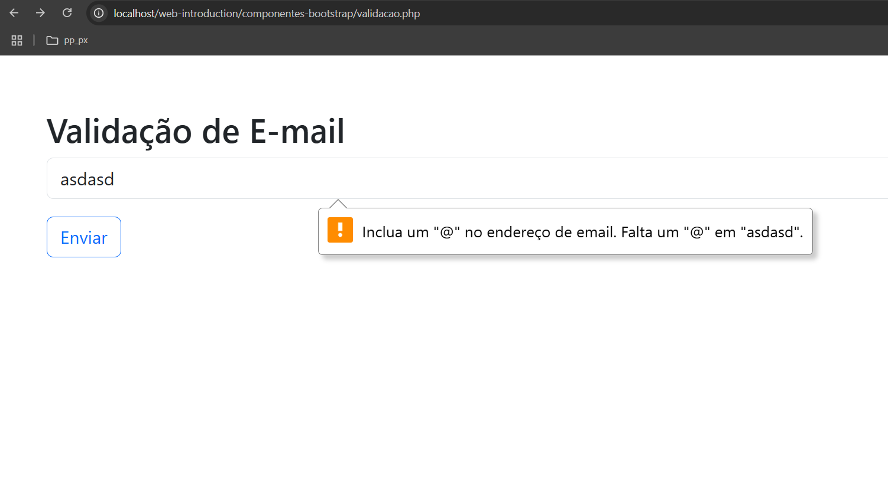
---

## 🔚 Conclusão

Com Bootstrap:
- Tudo fica mais bonito sem esforço
- Ccomportamentos prontos (modal, toast, botões responsivos)
- Não precisamos escrever css manualmente.