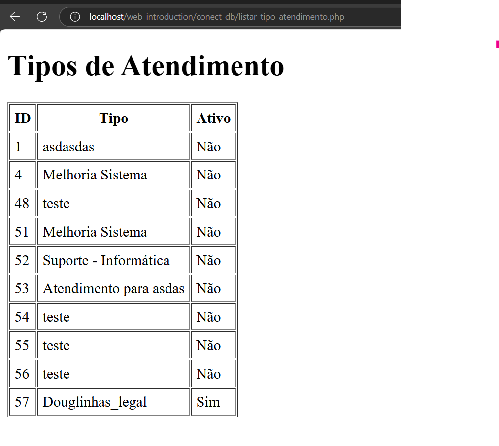

#  connect-DB

# 📘 Exemplo Prático: Conectando ao Banco e Exibindo Dados com PHP

✅ Objetivo
- Criar uma página PHP que:
- Conecta ao banco de dados MySQL.
- Busca todos os registros da tabela tipo_atendimento.


## 1 - Criando o DB

🔧 Passo 1: Criar o Banco e a Tabela no MySQL
Execute este script no seu MySQL (por exemplo, usando o phpMyAdmin):
Observação: Se voce ja tiver seu banco criado ou mapeado o banco do RAatendimento, não é necessário realizar esse passo.

```sql
CREATE DATABASE IF NOT EXISTS ratendimento;

USE ratendimento;

CREATE TABLE IF NOT EXISTS tipo_atendimento (
  id_tipo_atendimento INT NOT NULL AUTO_INCREMENT PRIMARY KEY,
  tipo_atendimento VARCHAR(45) NOT NULL,
  ativo VARCHAR(1) NOT NULL DEFAULT 'S'
);

-- Inserindo alguns dados de exemplo
INSERT INTO tipo_atendimento (tipo_atendimento) VALUES ('Presencial'), ('Online'), ('Telefone');

```


## 2 - Listar tipos de atendimento

🧩 Passo 2: Criar o Arquivo PHP
Vamos criar um arquivo chamado listar_tipo_atendimento.php com o seguinte conteúdo:

```php
<?php
// 1. Conexão com o banco de dados
$pdo = new PDO('mysql:host=localhost;dbname=ratendimento', 'root', '');

// 2. Executar SELECT para buscar todos os dados da tabela
$stmt = $pdo->query("SELECT * FROM tipo_atendimento");

// 3. Guardar os dados retornados em uma variável
$tipos = $stmt->fetchAll(PDO::FETCH_ASSOC);
?>

<!DOCTYPE html>
<html>
<head>
    <title>Lista de Tipos de Atendimento</title>
</head>
<body>
    <h1>Tipos de Atendimento</h1>
    <table border="1" cellpadding="5">
        <tr>
            <th>ID</th>
            <th>Tipo</th>
            <th>Ativo</th>
        </tr>

        <?php foreach ($tipos as $tipo): ?>
            <tr>
                <td><?= $tipo['id_tipo_atendimento'] ?></td>
                <td><?= $tipo['tipo_atendimento'] ?></td>
                <td><?= $tipo['ativo'] === 'S' ? 'Sim' : 'Não' ?></td>
            </tr>
        <?php endforeach; ?>
    </table>
</body>
</html>

```

## 3 - Explicando o código

🧠 Explicação do Código

---
1. Conexão com o Banco de Dados

```php
$pdo = new PDO('mysql:host=localhost;dbname=ratendimento', 'root', '');

```
- mysql:host=localhost → estamos acessando o banco na própria máquina.
- dbname=ratendimento → nome do banco criado no MySQL.
- 'root', '' → usuário e senha (vazio, se você não definiu uma senha no MySQL).

---
2. Executar a Consulta

```php
$stmt = $pdo->query("SELECT * FROM tipo_atendimento");
```

- Fazemos uma consulta SQL (SELECT *) para trazer todos os dados da tabela.

---
3. Pegar os Dados em Forma de Array

```php
$tipos = $stmt->fetchAll(PDO::FETCH_ASSOC);
```
- Transforma o resultado da consulta em um array associativo, para ser usado no HTML.

---

4. Mostrar os Dados na Tabela HTML

```php
<?php foreach ($tipos as $tipo): ?>
    <tr>
        <td><?= $tipo['id_tipo_atendimento'] ?></td>
        <td><?= $tipo['tipo_atendimento'] ?></td>
        <td><?= $tipo['ativo'] === 'S' ? 'Sim' : 'Não' ?></td>
    </tr>
<?php endforeach; ?>
```
- Para cada linha da tabela, imprimimos os valores com <?= ... ?>.
- Usamos um foreach para percorrer cada registro retornado do banco.

## 🧪 Resultado Esperado

A página exibirá algo como:

| ID  | Tipo       | Ativo |
|-----|------------|-------|
| 1   | Presencial | Sim   |
| 2   | Online     | Sim   |
| 3   | Telefone   | Sim   |



📌 Conclusao

Adapte esta estrutura para a sua tabela de cadastro simples.