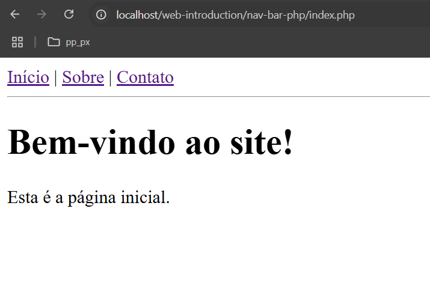
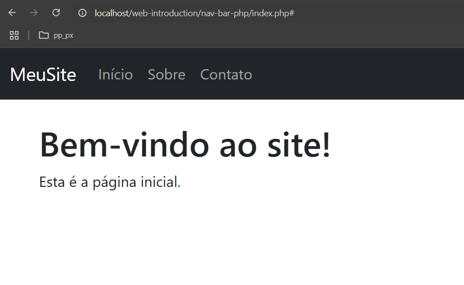
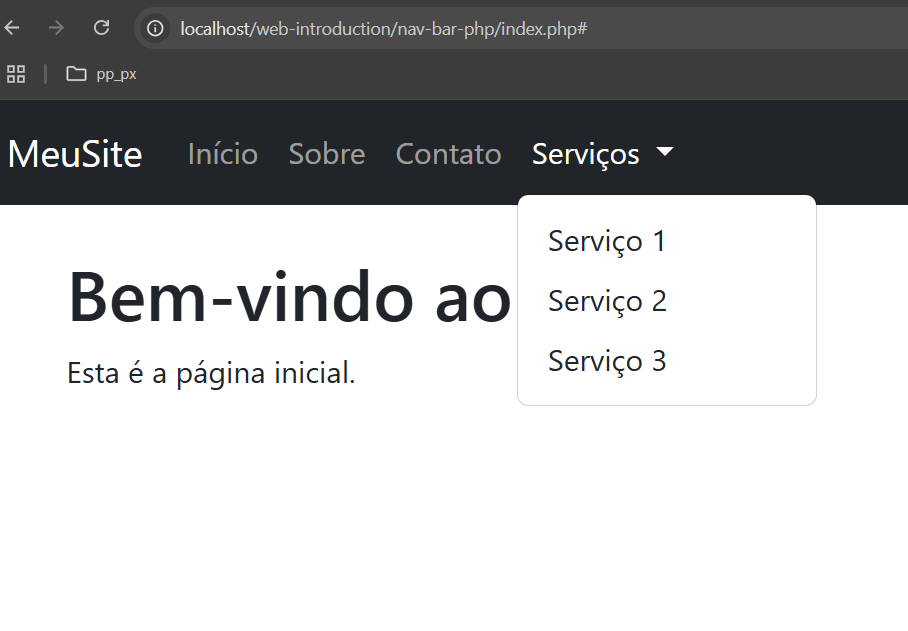
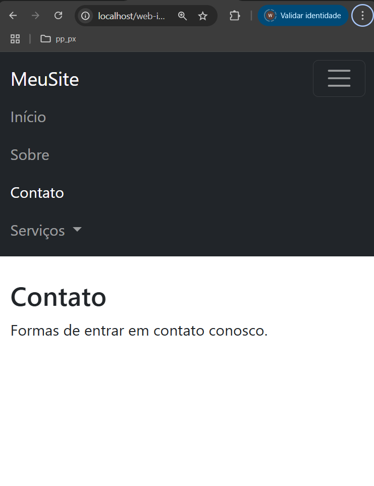

# Nav-Bar Simple em PHP

O objetivo deste repositório e mostrar de forma simples o funcionamento de uma Nav-Br para a disciplina de aplicação web

## O que é barra de navegação

---
🧠 Explicando em palavras simples:

- Navbar  (barra de navegação) é como o menu de um site.
- Ela tem links (como "Início", "Sobre", "Contato") que levam para outras partes do site.
- Vamos criar um arquivo PHP que carrega a navbar.
-Depois, em cada página, usamos o include para reaproveitar esse mesmo menu sem copiar e colar.


📁 Estrutura dos arquivos:

```css
meusite/
│
├── navbar.php         ← Aqui fica o menu
├── index.php          ← Página inicial
├── sobre.php          ← Página "Sobre"
└── contato.php        ← Página "Contato"
```
---

1. Criar o navbar.php

```html
<!-- navbar.php -->
<nav>
  <a href="index.php">Início</a> |
  <a href="sobre.php">Sobre</a> |
  <a href="contato.php">Contato</a>
</nav>
<hr>
```

🔹 Esse arquivo tem só um menu com 3 links.
🔹 O <hr> desenha uma linha para separar o menu do conteúdo.

---

2. Criar o index.php (página inicial)

```html
<!-- index.php -->
<?php include 'navbar.php'; ?>

<h1>Bem-vindo ao site!</h1>
<p>Esta é a página inicial.</p>

```

---

3. Criar o sobre.php

```html
<!-- sobre.php -->
<?php include 'navbar.php'; ?>

<h1>Sobre nós</h1>
<p>Informações sobre o site ou empresa.</p>

```

4. Criar o contato.php

```tsx
<!-- contato.php -->
<?php include 'navbar.php'; ?>

<h1>Contato</h1>
<p>Formas de entrar em contato conosco.</p>

```
---

✅ O que aprendemos até aqui com isso:

- O que é uma navbar.
- Como usar a tag a - href para criar links.
- Como reutilizar código com include em PHP.
- Como separar o menu do conteúdo.

## Estilizando o nosso navbar

✅ O que vamos fazer agora:

- Adicionar o link do Bootstrap.
- Substituir o menu simples por uma navbar do Bootstrap.
- Manter o include 'navbar.php' nas páginas.

Nosso resultado até aqui: 



📌 1. Link do Bootstrap

```html
<!-- Coloque isso dentro do <head> de cada página -->
<link href="https://cdn.jsdelivr.net/npm/bootstrap@5.3.3/dist/css/bootstrap.min.css" rel="stylesheet">
```
- Mas para evitar repetir esse código, podemos criar um arquivo header.php e fazer o include dele.

🧩 header.php (opcional, mas ajuda)

```php
<!-- header.php -->
<!DOCTYPE html>
<html lang="pt-br">
<head>
  <meta charset="UTF-8">
  <title>Meu Site</title>
  <link href="https://cdn.jsdelivr.net/npm/bootstrap@5.3.3/dist/css/bootstrap.min.css" rel="stylesheet">
</head>
<body>

```

E no final de cada página, podemos colocar um footer.php:

```php
<!-- footer.php -->
</body>
</html> 
```

🧭 2. navbar.php com Bootstrap

Vamos adaptar o nosso navbar:

```html
<!-- navbar.php -->
<nav class="navbar navbar-expand-lg navbar-dark bg-dark">
  <div class="container-fluid">
    <a class="navbar-brand" href="index.php">MeuSite</a>
    <div class="collapse navbar-collapse">
      <ul class="navbar-nav me-auto">
        <li class="nav-item">
          <a class="nav-link" href="index.php">Início</a>
        </li>
        <li class="nav-item">
          <a class="nav-link" href="sobre.php">Sobre</a>
        </li>
        <li class="nav-item">
          <a class="nav-link" href="contato.php">Contato</a>
        </li>
      </ul>
    </div>
  </div>
</nav>
```

🏠 index.php (atualizado)

```php
<!-- index.php -->
<?php include 'header.php'; ?>
<?php include 'navbar.php'; ?>

<div class="container mt-4">
  <h1>Bem-vindo ao site!</h1>
  <p>Esta é a página inicial.</p>
</div>

<?php include 'footer.php'; ?>

```

🧾 sobre.php e contato.php seguem o mesmo padrão:

```php
<?php include 'header.php'; ?>
<?php include 'navbar.php'; ?>

<div class="container mt-4">
  <h1>Sobre nós</h1>
  <p>Informações sobre o site.</p>
</div>

<?php include 'footer.php'; ?>

```

Com os códigos acima, verificamos que mantemos padrão de cabeçalho, rodaé e navegação, com foco na organização do nosso código.

- 🎓 O que aprendemos agora:
- Como usar o Bootstrap para estilizar uma navbar.
- Como dividir o site em partes reaproveitáveis: header.php, navbar.php, footer.php.
- Como manter o código organizado e bonito.

Nosso resultado até aqui: 



## Adicionando um menu com dropdown na nossa navbar

🧭 navbar.php com um dropdown

```html
<!-- navbar.php -->
<nav class="navbar navbar-expand-lg navbar-dark bg-dark">
  <div class="container-fluid">
    <a class="navbar-brand" href="index.php">MeuSite</a>
    <button class="navbar-toggler" type="button" data-bs-toggle="collapse" data-bs-target="#navbarNav">
      <span class="navbar-toggler-icon"></span>
    </button>

    <div class="collapse navbar-collapse" id="navbarNav">
      <ul class="navbar-nav me-auto">
        <li class="nav-item">
          <a class="nav-link" href="index.php">Início</a>
        </li>
        <li class="nav-item">
          <a class="nav-link" href="sobre.php">Sobre</a>
        </li>
        <li class="nav-item">
          <a class="nav-link" href="contato.php">Contato</a>
        </li>

        <!-- Dropdown -->
        <li class="nav-item dropdown">
          <a class="nav-link dropdown-toggle" href="#" id="navbarDropdown" role="button" data-bs-toggle="dropdown">
            Serviços
          </a>
          <ul class="dropdown-menu">
            <li><a class="dropdown-item" href="#">Serviço 1</a></li>
            <li><a class="dropdown-item" href="#">Serviço 2</a></li>
            <li><a class="dropdown-item" href="#">Serviço 3</a></li>
          </ul>
        </li>
      </ul>
    </div>
  </div>
</nav>

```

🔧 Importante: adicionar o JS do Bootstrap, para animações

Para que o dropdown funcione corretamente, é preciso carregar o JavaScript do Bootstrap no final do footer.php:

Aqui está a nova versão do navbar.php com um item "Serviços" que tem um menu dropdown:

```php
<!-- footer.php -->
<script src="https://cdn.jsdelivr.net/npm/bootstrap@5.3.3/dist/js/bootstrap.bundle.min.js"></script>
</body>
</html>

```

✅ O que os alunos aprendem com isso:
- Como funciona um dropdown em uma navbar.
- Que o Bootstrap precisa de JavaScript para menus interativos.
- Que o menu pode crescer com subitens facilmente.



## Sinalizando a aba ativa

🧠 Como vamos fazer:
Usaremos PHP para comparar a página atual com os links da navbar. Quando for a página ativa, colocamos a classe active do Bootstrap, que muda a cor do botão do menu.

✅ Atualização no navbar.php:
Vamos usar basename($_SERVER['PHP_SELF']) para descobrir qual é a página atual (por exemplo, index.php, sobre.php, etc.):

```html
<!-- navbar.php -->
<?php
  $paginaAtual = basename($_SERVER['PHP_SELF']);
?>

<nav class="navbar navbar-expand-lg navbar-dark bg-dark">
  <div class="container-fluid">
    <a class="navbar-brand" href="index.php">MeuSite</a>
    <button class="navbar-toggler" type="button" data-bs-toggle="collapse" data-bs-target="#navbarNav">
      <span class="navbar-toggler-icon"></span>
    </button>

    <div class="collapse navbar-collapse" id="navbarNav">
      <ul class="navbar-nav me-auto">
        <li class="nav-item">
          <a class="nav-link <?php if ($paginaAtual == 'index.php') echo 'active'; ?>" href="index.php">Início</a>
        </li>
        <li class="nav-item">
          <a class="nav-link <?php if ($paginaAtual == 'sobre.php') echo 'active'; ?>" href="sobre.php">Sobre</a>
        </li>
        <li class="nav-item">
          <a class="nav-link <?php if ($paginaAtual == 'contato.php') echo 'active'; ?>" href="contato.php">Contato</a>
        </li>

        <!-- Dropdown -->
        <li class="nav-item dropdown">
          <a class="nav-link dropdown-toggle <?php if (in_array($paginaAtual, ['servico1.php', 'servico2.php', 'servico3.php'])) echo 'active'; ?>" 
             href="#" id="navbarDropdown" role="button" data-bs-toggle="dropdown">
            Serviços
          </a>
          <ul class="dropdown-menu">
            <li><a class="dropdown-item" href="#">Serviço 1</a></li>
            <li><a class="dropdown-item" href="#">Serviço 2</a></li>
            <li><a class="dropdown-item" href="#">Serviço 3</a></li>
          </ul>
        </li>
      </ul>
    </div>
  </div>
</nav>

```

📌 Resultado:
- A aba "Início" ficará destacada quando o usuário estiver em index.php.
- "Sobre" ficará ativa em sobre.php.
- "Contato" em contato.php.


## Responsividade e menu Hamburger

✅ O que a navbar responsiva precisa:
- Botão hambúrguer (ícone de menu) aparece em telas pequenas.
- Esse botão abre e fecha o menu com JavaScript do Bootstrap.
- A estrutura precisa do navbar-toggler, do data-bs-toggle, e do collapse.

Vamos revisar o navbar.php com tudo organizado e funcional:

```php
<?php
  $paginaAtual = basename($_SERVER['PHP_SELF']);
?>

<nav class="navbar navbar-expand-lg navbar-dark bg-dark">
  <div class="container-fluid">
    <a class="navbar-brand" href="index.php">MeuSite</a>

    <!-- Botão hamburguer para telas pequenas -->
    <button class="navbar-toggler" type="button" data-bs-toggle="collapse" data-bs-target="#navbarNav">
      <span class="navbar-toggler-icon"></span>
    </button>

    <!-- Menu que colapsa -->
    <div class="collapse navbar-collapse" id="navbarNav">
      <ul class="navbar-nav me-auto">
        <li class="nav-item">
          <a class="nav-link <?php if ($paginaAtual == 'index.php') echo 'active'; ?>" href="index.php">Início</a>
        </li>
        <li class="nav-item">
          <a class="nav-link <?php if ($paginaAtual == 'sobre.php') echo 'active'; ?>" href="sobre.php">Sobre</a>
        </li>
        <li class="nav-item">
          <a class="nav-link <?php if ($paginaAtual == 'contato.php') echo 'active'; ?>" href="contato.php">Contato</a>
        </li>

        <!-- Dropdown -->
        <li class="nav-item dropdown">
          <a class="nav-link dropdown-toggle <?php if (in_array($paginaAtual, ['servico1.php', 'servico2.php', 'servico3.php'])) echo 'active'; ?>"
             href="#" id="navbarDropdown" role="button" data-bs-toggle="dropdown">
            Serviços
          </a>
          <ul class="dropdown-menu">
            <li><a class="dropdown-item" href="#">Serviço 1</a></li>
            <li><a class="dropdown-item" href="#">Serviço 2</a></li>
            <li><a class="dropdown-item" href="#">Serviço 3</a></li>
          </ul>
        </li>
      </ul>
    </div>  </div>
</nav>

```

🎯 Agora a nossa navbar:

- Mostra qual página está ativa.
- Tem um dropdown de serviços.
- Fica colapsada em telas pequenas e mostra o botão de menu.

Abre e fecha corretamente graças ao JavaScript do Bootstrap.



## Conclusão

Agora fica facil de colocar qualquer página ou crud que construirmos vinculado ao nosso código
